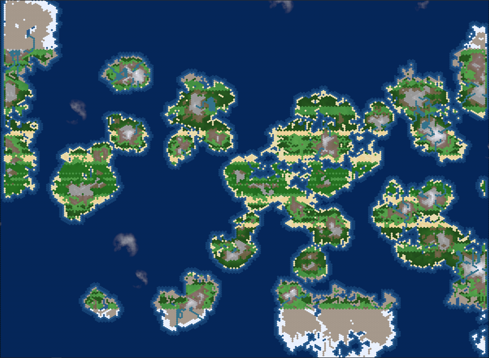

# Living Worlds

<p align="center">
  
</p>

<p align="center">
  <i>A hands-off civilization observer simulation built with Bevy where you WATCH (not control) empires rise and fall eternally through emergent gameplay.</i>
</p>

## Overview

Living Worlds is a fully procedural civilization OBSERVER - like Fantasy Map Simulator, you have zero control over the civilizations. You can only watch as they emerge, grow, fight, and collapse. Every texture, sound, and piece of text is generated at runtime. Observe as civilizations develop organically, advance through technologies at their own pace, build infrastructure that permanently marks the landscape, and manage complex economies based on Austrian economic principles. There is no victory condition and no player interaction - only the eternal cycle of rise and fall that you witness as a passive observer.

## 🎮 Features

### Currently Implemented
- **🗺️ Hexagonal World Map**: Configurable sizes with flat-top honeycomb layout
  - Small: 15,000 provinces (150x100)
  - Medium: 60,000 provinces (300x200)
  - Large: 135,000 provinces (450x300)
- **⚡ Mega-Mesh Rendering**: Revolutionary performance breakthrough
  - **60+ FPS** on large worlds (135,000 provinces)
  - Single mesh with 945,000 vertices instead of 135,000 entities
  - One GPU draw call for entire world
  - Dynamic vertex color updates for overlays
- **🌊 Realistic Ocean Depths**: Three-tier water depth system with beautiful gradients
  - Shallow coastal waters
  - Medium depth continental shelves  
  - Deep ocean trenches
- **🏔️ Procedural Terrain**: 12 terrain types including rivers and deltas
  - Dynamic biome distribution based on latitude
  - Rivers flowing from mountains to ocean with gameplay impact
  - Agriculture zones near water sources
  - Forests, jungles, deserts, tundra, and ice caps
- **☁️ Dynamic Weather**: Multi-layer procedural cloud system with wind
- **⛏️ Mineral Resources**: 9 mineral types with realistic vein distribution
  - Iron, Copper, Tin, Gold, Coal, Gems, Stone, Bronze, Steel
  - Heat map overlays for resource visualization
  - Combined richness view for all minerals
- **🎵 Procedural Music**: World tension-based soundtrack that evolves with conflicts
- **🏛️ Nations**: Territory-based civilizations with expansion mechanics
- **⏱️ Time Simulation**: Pause/play with 1x, 3x, 6x, 9x speed controls
- **📊 Map Overlays**: Political, individual minerals, all minerals, infrastructure views

### Controls
- **Camera**: WASD/Arrow keys for panning, mouse wheel for zoom, edge scrolling
- **Time**: Space to pause, 1-4 keys for speed control
- **Overlays**: M to cycle through map modes
- **Music Testing**: T/G to adjust world tension, Y/H for crisis events

## 🛠️ Technology Stack

- **Engine**: Bevy 0.16.1 (Modern Rust game engine)
- **Language**: Rust 2021 Edition
- **Graphics**: wgpu (Modern GPU API)
- **Audio**: Procedural generation with Bevy audio
- **Platform**: Windows, Linux, MacOS (Steam distribution planned)

## 📁 Architecture

The project uses a **modular plugin architecture** with Bevy's ECS (Entity Component System):

```
livingworlds/
├── src/                    # Source code (16 modules, ~176 KB, 4931 lines)
│   ├── lib.rs             # Library root, plugin orchestration
│   ├── main.rs            # Binary entry point, input handling  
│   ├── setup.rs           # World generation, MEGA-MESH creation
│   ├── simulation.rs      # Time simulation, world tension, population
│   ├── terrain.rs         # Terrain types, climate zones, biomes
│   ├── minerals.rs        # Resource generation and extraction
│   ├── overlay.rs         # Map overlay rendering with vertex colors
│   ├── clouds.rs          # Procedural cloud generation
│   ├── music.rs           # Dynamic tension-based music
│   ├── camera.rs          # Camera controls and viewport
│   ├── ui.rs              # User interface and HUD
│   ├── colors.rs          # All terrain and mineral color functions
│   ├── borders.rs         # Selection border (1 entity only!)
│   ├── components.rs      # ECS components definitions
│   ├── resources.rs       # Global game resources
│   └── constants.rs       # Game configuration constants
├── images/                 # Screenshots and documentation
├── Cargo.toml             # Rust dependencies
├── CLAUDE.md              # Detailed technical documentation
└── README.md              # This file

NOTE: No assets/ directory - everything is procedurally generated!
```

### Key Systems
- **Mega-Mesh Renderer**: Single mesh with 945,000 vertices for 60+ FPS
- **ECS Architecture**: Leverages Bevy's parallel processing
- **Plugin System**: Each module is a self-contained Bevy plugin
- **Deterministic Simulation**: Fixed-point math for consistency
- **Spatial Indexing**: O(1) province lookups for performance
- **Dynamic Vertex Colors**: Real-time overlay updates without recreating mesh

## 🚀 Getting Started

### Prerequisites

- Rust 1.75 or later
- Cargo (comes with Rust)

### Building & Running

```bash
# Clone the repository
git clone https://github.com/yourusername/livingworlds.git
cd livingworlds

# Run the game (optimized)
cargo run --release

# For faster compilation during development
cargo run --features bevy/dynamic_linking

# Run with specific seed for reproducible worlds
cargo run --release -- --seed 42

# Run with different world sizes
cargo run --release -- --world-size large
```

### Development Commands

```bash
# Run tests
cargo test

# Check code without building
cargo check

# Format code
cargo fmt

# Lint code
cargo clippy
```

## 🎯 Design Philosophy

- **Pure Observer**: You cannot control anything - only watch
- **Bottom-up Emergence**: Complex behaviors from simple rules
- **No Abstraction**: Model individuals, not statistics
- **Infinite Replayability**: Every world tells unique stories
- **Performance First**: Optimized for simulating thousands of entities

## 🗺️ Roadmap

### Near Term
- [ ] Individual agent simulation (every person as an entity)
- [ ] Austrian economics implementation
- [ ] Cultural emergence and language evolution
- [ ] Technology tree progression
- [ ] Infrastructure that modifies terrain

### Long Term
- [ ] Save/load system with Bevy Scenes
- [ ] Steam integration (achievements, cloud saves)
- [ ] Mod support through dynamic plugins
- [ ] Multiplayer observer mode
- [ ] Historical record export

## 🤝 Contributing

Living Worlds welcomes contributions! Please see `CLAUDE.md` for technical details.

1. Fork the repository
2. Create a feature branch (`git checkout -b feature/amazing-feature`)
3. Make your changes
4. Run tests (`cargo test`)
5. Submit a pull request

## 📚 Documentation

- **CLAUDE.md**: Comprehensive technical documentation
- **Code Comments**: Extensive inline documentation
- **Bevy Book**: https://bevyengine.org/learn/

## 📝 License

[License information to be added]

## 🌟 Acknowledgments

- Built with [Bevy](https://bevyengine.org/) - A refreshingly simple data-driven game engine
- Inspired by Fantasy Map Simulator and similar observer games
- Hexagon math from [Red Blob Games](https://www.redblobgames.com/grids/hexagons/)

---

*Living Worlds - Watch civilizations rise and fall in an endless dance of history*